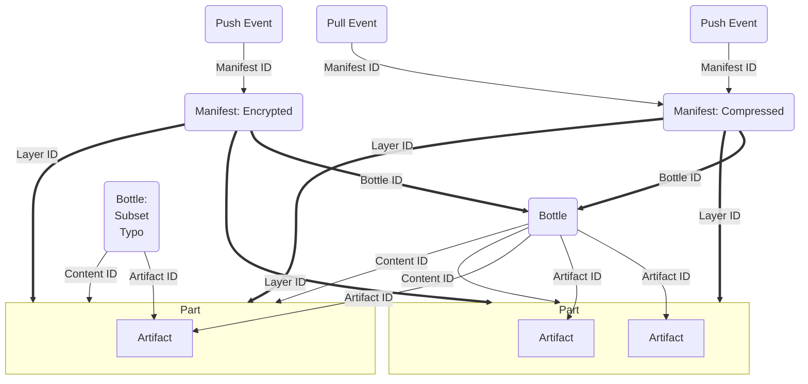

# Bottle Anatomy Guide

## Intended Audience

This concept guide is written for Data Tool users who want to understand the anatomy and data model of a bottle.

> Consult the [Data Tool User Guide](../user-guide.md) to review Data Tools's key concepts and common usage patterns

## Prerequisites

This guide does not have prerequisites for the intended audience.

## Bottle Anatomy

Bottles are made up of parts. Parts are files that contain the bulk data of the bottle.

## Diagram

In the diagram below, bold arrows illustrate references between bottles, which follow requirements of the Open Container Initiative (OCI) specification. All digests (IDs) in this model are verified when data is downloaded.

### Data Model Definitions

- Content: a file otherwise an archived directory
- Content ID: digest of the content
- Artifact ID: digest of the public artifact file (directories are not supported for artifacts)
- Bottle ID: digest of the bottle config JSON.  Analogous to the OCI Image ID.
- Layer ID: digest of the compressed (and possibly encrypted) content
- Manifest ID: digest of the manifest JSON

## Compression

Data Tool handles compression programmatically. Compression is only used when it provided a measurable benefit in file size. When compression and encryption are not used, the Layer ID and the Content ID can be the same.

The data is packaged in such a way that the digests used for de-duplication and verification only change when the data changes.

- Dates: always POSIX time of zero (1970)
- Owners and groups: always root
- Permissions: always 600
- Symlinks: resolved to remove symlinks
- Hard links: resolved to remove hardlinks

## See Also

[Bottle Anatomy Tutorial](../tutorials/bottle-anatomy.md){ .md-button }
