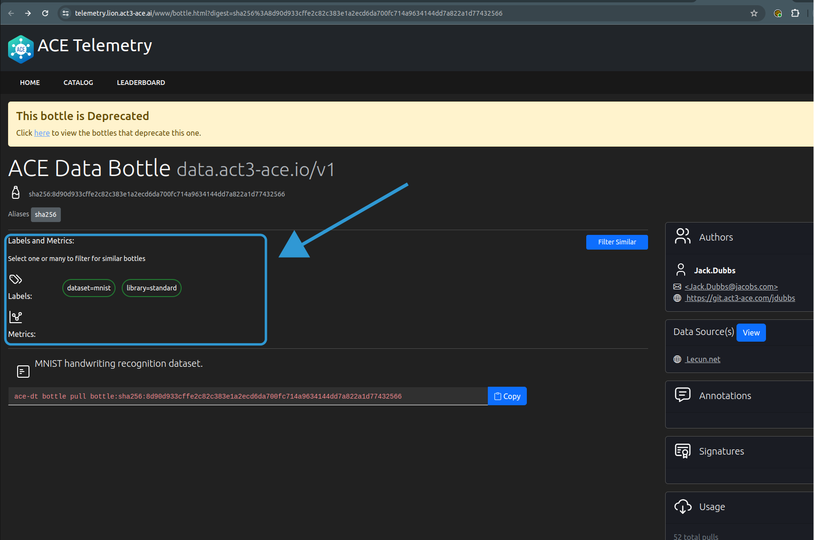
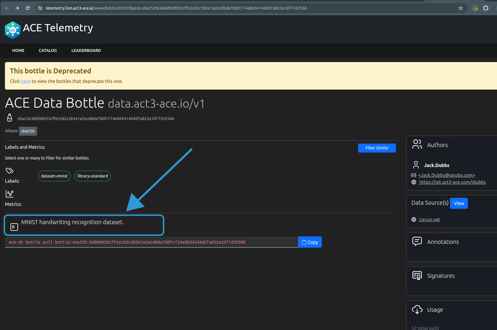
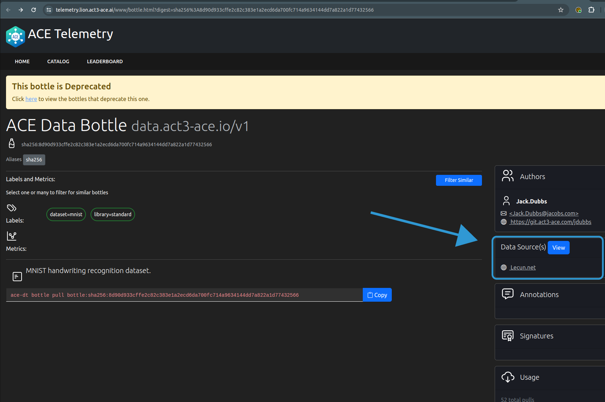
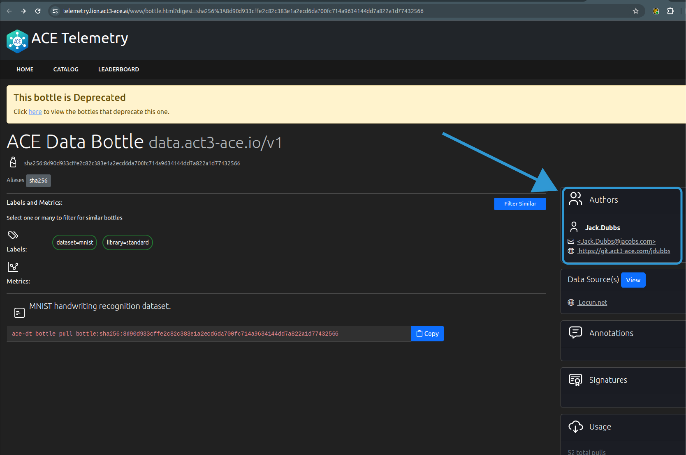
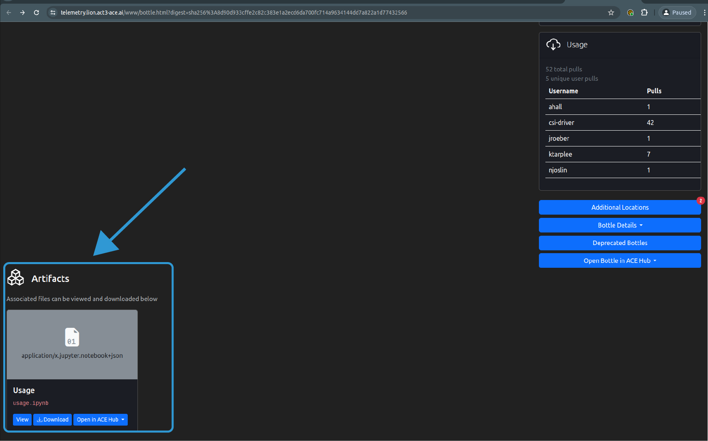
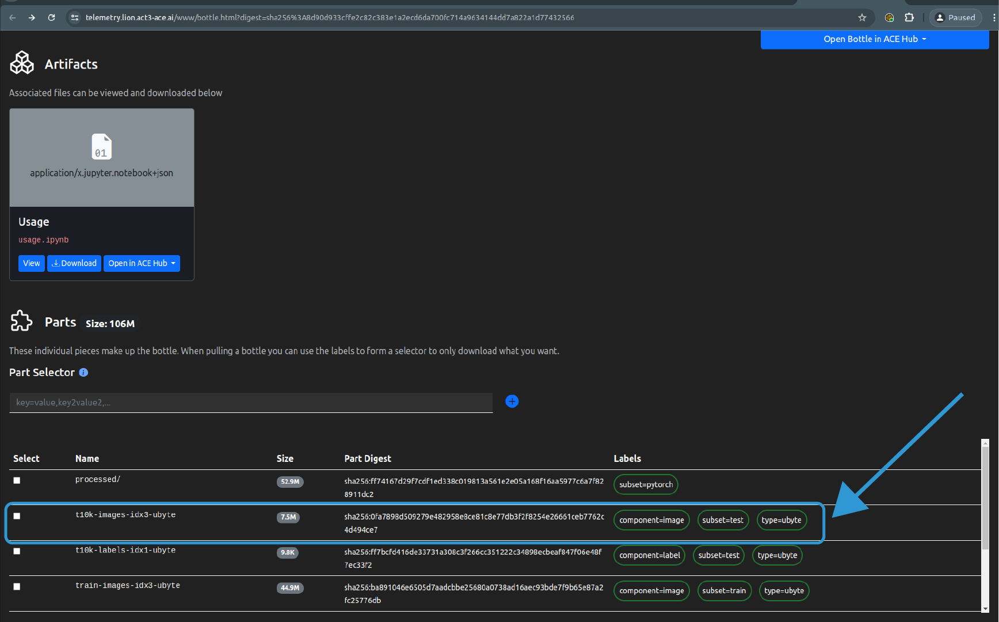

# Bottle Anatomy Tutorial

## Intended Audience

This tutorial is written for new Data Tool users who want to inspect an existing bottle's anatomy.

## Guided Scenario

In this scenario, a user pulls an existing bottle that has already been created by an ACT3 developer, inspects the bottle locally to understand the bottle anatomy, and compares the anatomy to what is displayed in the ASCE Telemetry server.

## Prerequisites

It is assumed that readers have familiarity with Data Tools's key concepts and common usage patterns.

> Consult the [Data Tool User Guide](../user-guide.md), if needed

| Task or Tool | Type | Resources |
| ------------ | ---- | --------- |
| Data Tool configuration file established at `~/.config/ace/dt/config.yaml` | Required | [Data Tool Configuration Guide](../../get-started/configuration-guide.md) |
| Connected to ACT3 VPN | Required | |

## Workflow Overview

Users who complete this tutorial will:

- Use Data Tool to pull an existing bottle created by an ACT3 developer
- Inspect the bottle's content
- Inspect the `.dt` directory
- Inspect the metadata associated with the bottle
- Observe the bottle in the ASCE Telemetry server
- Inspect the bottle's metadata displayed in the GUI

## Step-by-Step Instructions

### Pull the Existing Bottle

Navigate to an empty directory.

Use Data Tool to pull the existing bottle and populate the current working directory:

```sh
ace-dt bottle pull us-central1-docker.pkg.dev/aw-df16163b-7044-4662-93fa-ec0/public-down-auth-up/mnist:v1.6
```

The expected output is:

```sh
ace-dt bottle pull us-central1-docker.pkg.dev/aw-df16163b-7044-4662-93fa-ec0/public-down-auth-up/mnist:v1.6
Pulling Bottle ↦ Fetching Manifest...
Pulling Bottle | sha256:b5b343f118486ae193619682dcb79945d70b863efebe74ef26c0acd7cbba3fb0 ↦ Completed in 0s
Pulling Bottle ↦ Pulling parts
Pulling Bottle ↦ Completed [1] (cached)
 ↦ Successfully notified the telemetry server(s).  To view the bottle, browse to any of the following locations:
    https://telemetry.lion.act3-ace.ai/www/bottle.html?digest=sha256%3A8d90d933cffe2c82c383e1a2ecd6da700fc714a9634144dd7a822a1d77432566
```

> If you see an error indicating `telemetry reporting delegate failed`, verify that you are connected to the ACT3 VPN

### Inspect the Bottle's Content

Observe the files and directories:

```sh
tree
```

The expected output is:

```txt
├── processed
│   ├── test.pt
│   └── training.pt
├── t10k-images-idx3-ubyte
├── t10k-labels-idx1-ubyte
├── train-images-idx3-ubyte
├── train-labels-idx1-ubyte
└── usage.ipynb

1 directory, 7 files
```

Then, use the `ls` command to see the dot files and directories associated with the bottle:

```sh
ls -la
```

The expected output should be similar to the following:

```txt
total 54472
drwxrwxr-x 4 user  user      4096 Apr 29 09:35 .
drwxrwxr-x 7 user  user      4096 Apr 29 09:35 ..
drwxrwxr-x 2 user  user      4096 Apr 29 09:35 .dt
-rw-rw-r-- 1 user  user       397 Apr 29 09:35 .labels.yaml
drwxrwxr-x 2 user  user      4096 Apr 29 09:35 processed
-rw-rw-r-- 1 user  user   7840016 Apr 29 09:35 t10k-images-idx3-ubyte
-rw-rw-r-- 1 user  user     10008 Apr 29 09:35 t10k-labels-idx1-ubyte
-rw-rw-r-- 1 user  user  47040016 Apr 29 09:35 train-images-idx3-ubyte
-rw-rw-r-- 1 user  user     60008 Apr 29 09:35 train-labels-idx1-ubyte
-rw-rw-r-- 1 user  user    795316 Apr 29 09:35 usage.ipynb
```

### Inspect the .dt Directory

Since this bottle was already created, initialized, and pushed by an ACT3 developer and since bottles are immutable, we can observe all of the metadata that was associated with the bottle.

Navigate into the `.dt` directory:

```sh
cd .dt
```

Observe the files in the directory:

```sh
tree
```

The expected output is:

```txt
├── bottleid
├── entry.yaml
├── parts.json
├── pullcmd
└── vlayers.json

0 directories, 5 files
```

### Inspect Metadata Associated with the Bottle

The `entry.yaml` file contains the bottle-level metadata. Specifically, it contains the following metadata fields:

- Labels and annotations
- Description
- Authors
- Metrics
- Sources

Observe the contents of the `entry.yaml` file for this bottle:

```sh
cat entry.yaml
```

The expected output is:

```txt
# ACE Data Bottle definition document containing the metadata

apiVersion: data.act3-ace.io/v1
kind: Bottle

# Labels are used to classify a bottle.  Selectors can later be used on these labels to select a subset of bottles.
# Follows Kubernetes conventions for labels.
labels:
    dataset: mnist
    library: standard

# Arbitrary user-defined content. Useful for storing non-standard metadata.
# Follows Kubernetes conventions for annotations.
annotations: {}
# key: "some value that is allowed to contain spaces and other character!"

# A human readable description of this Bottle.
# This field will be searched by researchers to discover this bottle.
description: |-
    MNIST handwriting recognition dataset.

# Information about the bottle sources (where this bottle came from)
sources:
    - name: Lecun.net
      uri: http://yann.lecun.com/exdb/mnist/

# Contact information for bottle authors
authors:
    - name: Jack.Dubbs
      email: Jack.Dubbs@jacobs.com
      url: https://git.act3-ace.com/jdubbs

# Contains metric data for a given experiment
metrics: []
# - name: log loss
#   description: natural log of the loss function
#   value: "45.2" # must be a numeric string (the quotes are required)

# Files intended to be exposed to the telemetry server for easy viewing
publicArtifacts:
    - name: Usage
      path: usage.ipynb
      mediaType: application/x.jupyter.notebook+json
      digest: sha256:996f3af4280d349c83be4e2af46f0d7200bcd90c31607f67868c0f8eda123155

# Bottle ID(s) to be deprecated by this bottle
deprecates: []
# - sha256:deedbeef # bottle ID

# Each bottle part may also have "part labels".
```

Bottles can have parts and those parts can also have metadata associated with them. This bottle provides an example.

Navigate back to the root directory of the bottle:

```sh
cd ..
```

Observe the contents of the `.labels.yaml` file for this bottle:

```sh
cat .labels.yaml
```

The expected output is:

```txt
labels:
  processed/:
    subset: pytorch
  t10k-images-idx3-ubyte:
    component: image
    subset: test
    type: ubyte
  t10k-labels-idx1-ubyte:
    component: label
    subset: test
    type: ubyte
  train-images-idx3-ubyte:
    component: image
    subset: train
    type: ubyte
  train-labels-idx1-ubyte:
    component: label
    subset: train
    type: ubyte
  usage.ipynb:
    type: usage
```

An alternative way to observe the metadata associated with the bottle parts is using the following command:

```sh
ace-dt bottle part list
```

The expected output for this bottle is:

```txt
PART                    SIZE    LABELS                                   
processed/              55 MB   subset=pytorch                           
t10k-images-idx3-ubyte  7.8 MB  component=image, subset=test, type=ubyte 
t10k-labels-idx1-ubyte  10 kB   type=ubyte, component=label, subset=test 
train-images-idx3-ubyte 47 MB   component=image, subset=train, type=ubyte
train-labels-idx1-ubyte 60 kB   subset=train, type=ubyte, component=label
usage.ipynb             795 kB  type=usage
```

### Observe the Bottle in the ASCE Telemetry Server

When the bottle was successfully pulled, the CLI output provided a link to the bottle in the ASCE Telemetry server. Use that link now:

```sh
ace-dt bottle pull us-central1-docker.pkg.dev/aw-df16163b-7044-4662-93fa-ec0/public-down-auth-up/mnist:v1.6
Pulling Bottle ↦ Fetching Manifest...
Pulling Bottle | sha256:b5b343f118486ae193619682dcb79945d70b863efebe74ef26c0acd7cbba3fb0 ↦ Completed in 0s
Pulling Bottle ↦ Pulling parts
Pulling Bottle ↦ Completed [1] (cached)
 ↦ Successfully notified the telemetry server(s).  To view the bottle, browse to any of the following locations:
    https://telemetry.lion.act3-ace.ai/www/bottle.html?digest=sha256%3A8d90d933cffe2c82c383e1a2ecd6da700fc714a9634144dd7a822a1d77432566
```

When the browser page opens, begin inspecting the bottle's metadata displayed in the GUI.

First, note the labels we observed in the `.dt/entry.yaml` file. They were:

```txt
# Labels are used to classify a bottle.  Selectors can later be used on these labels to select a subset of bottles.
# Follows Kubernetes conventions for labels.
labels:
    dataset: mnist
    library: standard
```

In the ASCE Telemetry server's GUI, we see those labels shown in the **Labels and Metrics** region:



Next, note the description we observed in the `.dt/entry.yaml` file. It was:

```txt
# A human readable description of this Bottle.
# This field will be searched by researchers to discover this bottle.
description: |-
    MNIST handwriting recognition dataset.
```

In the ASCE Telemetry server's GUI, we see that description shown **below the Labels and Metrics** region:



Next, let's locate the metadata related to the bottle's source. In the `.dt/entry.yaml` file, it was:

```txt
# Information about the bottle sources (where this bottle came from)
sources:
    - name: Lecun.net
      uri: http://yann.lecun.com/exdb/mnist/
```

In the ASCE Telemetry server's GUI, we see those metadata in the **Data Sources** region:



Next, we'll compare the author metadata. In the `.dt/entry.yaml`, it was:

```txt
# Contact information for bottle authors
authors:
    - name: Jack.Dubbs
      email: Jack.Dubbs@jacobs.com
      url: https://git.act3-ace.com/jdubbs
```

In the ASCE Telemetry server's GUI, we see those metadata in the **Authors** region:



Finally, for the bottle-level metadata, note that this bottle has an artifact associated with it. In the `.dt/entry.yaml` file, it was:

```txt
# Files intended to be exposed to the telemetry server for easy viewing
publicArtifacts:
    - name: Usage
      path: usage.ipynb
      mediaType: application/x.jupyter.notebook+json
      digest: sha256:996f3af4280d349c83be4e2af46f0d7200bcd90c31607f67868c0f8eda123155
```

In the ASCE Telemetry server's GUI, we can locate, view, and download that file in the **Artifacts** region:



Recall that this bottle has parts and those parts have metadata associated with them. We can also inspect these in the ASCE Telemetry server's GUI.

Recall that in the `label.yaml` file, we saw that the bottle part called `t10k-images-idx3-ubyte` had the following metadata associated with it:

```txt
component: image
subset: test
type: ubyte
```

We see these metadata associated with that bottle part in the ASCE Telemetry server's GUI, in the **Parts** region:



## See Also

[Bottle Anatomy Guide](../concepts/bottle-anatomy.md){ .md-button } [Labels and Selectors Guide](../concepts/labels-selectors.md){ .md-button }
