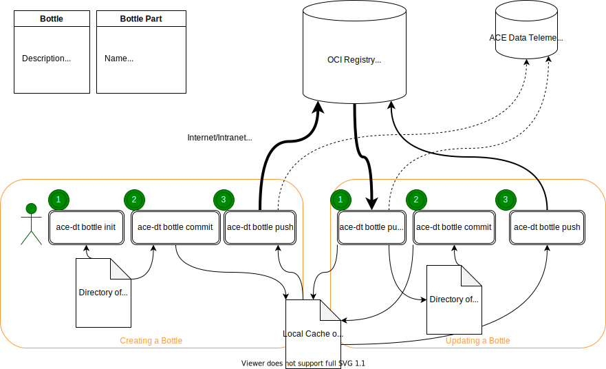

# Data Tool User Guide

## Intended Audience

This documentation is written for people who will use Data Tool as a bottle consumer, a bottle creator, or in both roles.

## Prerequisites

It is assumed that readers have:

- [Installed Data Tool](../get-started/installation-guide.md)
- Completed the [Data Tool Quick Start Guide](../get-started/quick-start-guide.md)

## Overview

Project Tool's CLI commands are documented in the CLI Reference documentation. This guide is not intended to replace CLI Reference documentation. Instead, it introduces key concepts and common usage patterns.

Supplemental concept guides and tutorials are also available.

## Terminology

People who work with data bottles are typically researchers, data scientists, or AI/ML practitioners. When we describe users who create and modify bottles, we use the terms *bottle creator* or *bottle author*. When we describe users who pull and retrieve bottles, we use the term *bottle consumer*.

The term *data bottle* was developed by ACT3 to describe a directory that is initialized as a bottle, then tracked, compressed (if needed), then pushed. When a bottle is pushed, it is stored in an OCI registry. If a telemetry server is configured, a bottle becomes discoverable and searchable after it is pushed.

Bottles can have metadata associated when a bottle is being created. We refer to the fields where metadata descriptors are added as *labels*.

Labels are the way that bottle authors can classify and identify sets of bottles. Labels can be used to identify anything a user might want to use when later select bottles from a telemetry server. Often, labels are used to specify the following:

- Project that created it, e.g. `project=COACH`
- Type of bottle, e.g. `type=model`, `problem=classification`
- (Hyper)parameters used to generate the model, e.g. `learning-rate=0.005`, `layers=7`
- Source code version, e.g. `version=v0.2.4`

Labels can also be used on parts of bottles. For example, a bottle representing a data set might have both the training and test sets contained within it as different parts. In that case, you would want to label them set with something like `subset=train` and `subset=test`, respectively. That way a user can restrict/limit what they download if only a few parts are required.

When the values in a bottle's metadata fields are used by consumers running queries in a telemetry server, we refer to them as *selectors*.

*Selectors* are used by bottle consumers to construct their queries and narrow their results to the subset of bottles that are most applicable to their current task. Following similar logic, selectors can then be used to pull a bottle or part(s) of a bottle.

The syntax used is the same as [Kubernetes label selectors](https://kubernetes.io/docs/concepts/overview/working-with-objects/labels/#label-selectors).

> Eventually this Data Tool feature might be extended to become a superset of what Kubernetes provides

## Data Bottles

Bottles are created to capture, archive, describe, and share datasets, experiments, and ML models.

Bottles are data with associated metadata (e.g., authors, description, sources) that are stored in any OCI compliant registry.

Bottles can be:

- Initialized
- Committed
- Pushed
- Pulled (in whole or in part)

Bottles can be conceptually divided into the bottle and the bottle part. All bottles are made up of many parts, which are the subdirectories and files inside a directory that has been initialized as a bottle.

The bottle contains:

- Description
- Authors
- Keywords
- Sources
- Artifacts
- Parts

The bottle part contains:

- Name
- Format
- Digest
- Uncompressed size
- Label(s)

Each bottle:

- Has a BottleID
- Is invariant to the compression level, compression algorithm, storage location, and encryption (coming soon)

The BottleID:

- Is the cryptographic digest of all the parts and metadata
- Serves as a unique identifier for the bottle
- Stays constant for the bottle, even as it is moved around between disconnected environments (e.g., air gapped environments)

When a directory is initialized as a bottle, a Bottle ID is generated. The Bottle ID is the unique identifier. Bottles do not have a name or title.

By inspecting the Bottle ID, a bottle consumer can ensure they are working with the intended dataset for accuracy and consistency in their experimentation.

### Working with Bottles

A data bottle is created when a directory is initialized using Data Tool. Bottles can exist locally but only become sharable and searchable when metadata are added and they are pushed to the OCI registry and a telemetry server is configured.

The diagram below shows the workflow for using a bottle, starting with bottle creation.

### Creating a Bottle

To make a bottle available to bottle consumers, a bottle creator completes the following steps:

- Initializes the directory as a bottle
- Adds metadata to the bottle
- Commits the bottle
- Pushes the bottle (to an OCI registry)

When a bottle creator follows the best practices defined in the [Bottle Creator Guide](../usage/concepts/bottle-creator.md), rich and accurate metadata will be added to the bottle and it's parts when it is created and before it is pushed. Metadata are essential to the ethical practices of rAI and make bottle usage more effective.

After a bottle is pushed, it can then be pulled and used by bottle consumers.

### Pushing a Bottle

Pushing a bottle is typically done when a new bottle is created or an existing bottle is modified. A bottle needs to be committed before it is pushed.

### Consuming a Bottle

When a bottle is pulled and utilized for research, experimentation, or training ML models, the process is known as consuming a bottle. Before a bottle can be pulled and used, it must be discovered or located.

For example, a consumer may find a bottle via a telemetry server, use that bottle for their own work, and then want to maintain their own copy of the bottle in a an OCI registry. In some use cases, the consumer may want to maintain their own copy of the data bottle that was pulled and used. In that case, the consumer would use the push command to send the bottle to an OCI registry of choice. If a telemetry server is configured, the data lineage will be tracked and associated with the new bottle.

### Finding a Bottle

Researchers use one or more telemetry server(s) to locate bottles of interest.

In cases where a researcher is looking for a specific bottle that is known to exist, the fastest way to retrieve it is by using the Bottle ID.

In all other cases, metadata added to a bottle become useful to bottle consumers when they query a telemetry server for bottles that are relevant to their work.

> Related: [ACT3 Telemetry Server](https://telemetry.ace.act3.ai/)

### Pulling a Bottle

When a researcher wants to use a bottle or part of a bottle, it must be pulled. Bottles can be pulled in whole or in part. If a bottle creator has followed the best practices defined in the [Bottle Creator Guide](../usage/concepts/bottle-creator.md), rich and accurate metadata were added to the bottle and it's parts when it was created and before it was pushed.

As a result, bottle consumers can then locate or discover the bottle in a telemetry server.

When the bottle's parts have meaningful labels, consumers can then identify and pull only the parts of a bottle relevant to their work.

Examples:

- A bottle might have images and labels for those images in different parts
  - For unsupervised learning, only the images are needed and not the labels
- A bottle might have different parts for blue images and red images
  - For an experiment, only the blue images are needed
- A bottle might have different parts for training and testing
  - For a training task, only the training-related data are needed and not the testing-related data

Best practices for bottle labels, bottle part labels, and other metadata are defined and described in the [Bottle Creator Guide](../usage/concepts/bottle-creator.md).

Notes about Data Lineage When Pulling Bottles:

- When a bottle is pulled
  - the command is recorded in `.dt/pullcmd`
  - the bottle ID is stored in `.dt/bottleid`
- If changes are made to a bottle with a `.dt/bottleid` file:
  - The previous bottle is *deprecated*, meaning that the current bottle is an intentional replacement for the previous bottle
  - Deprecated bottles can be filtered out in the Telemetry web app, allowing for only the most recent bottles to be used
- The automated metadata tracking makes it easy for a researcher to share experiment data with colleagues

### Customizing a Bottle

Any modification of a bottle will result in the creation of a new bottle, which will have a new BottleID. Customizing a bottle may be necessary when data in the bottle are modified or when metadata about the bottle are added or edited.

The new bottle will need to be committed and pushed to an OCI registry and/or a telemetry server before it is discoverable by bottle consumers.

#### Next Steps for Working with Bottles

To get started with bottles, consult the following resources:

- [Bottle Creator Guide](../usage/concepts/bottle-creator.md)
- [Bottle Anatomy Guide](../usage/concepts/bottle-anatomy.md)
- [Label Selector Guide](../usage/concepts/labels-selectors.md)

## OCI Registries

The data in a bottle can be pushed to and stored in a designated OCI registry. Each registry handles access controls to the actual data, allowing researchers to restrict access to the data within the bottle to only authorized users. Data Tool makes heavy use of the OCI data model and content addressable storage to avoid duplicate work. For example, a local cache of bottle parts is maintained to ensure that parts are not uploaded or downloaded more than once.

The following registries are known to work:

- [Google Artifact Registry](https://cloud.google.com/artifact-registry) (GAR)
- [Docker distribution](https://github.com/distribution/distribution) (i.e., the docker image registry:2)
- [GitLab Container Registry](https://docs.gitlab.com/ee/user/packages/container_registry/)
- [JFrog Container Registry](https://jfrog.com/container-registry/)
- [Zot Registry](https://zotregistry.dev/v2.0.3/)
- [Harbor Registry](https://goharbor.io/)

> - [Oras](https://github.com/oras-project/distribution) is compatible with the OCI 1.1 distribution spec but may have other limitations
> - Nexus is only partially OCI compliant and thus may have limitations when used with Data Tool

### Next Steps for Working with OCI Registries

To get started with registries, consult the following resource:

- [Configuration Guide](../get-started/configuration-guide.md)

## Telemetry Servers

Data Tool manages archival, compression, verification (cryptographic digest calculations) processes and registers bottles in one or more designated telemetry servers when a bottle is pushed to an OCI registry.

The metadata associated with a bottle are recorded and become searchable on the telemetry server. Metadata should be considered public. No sensitive data should be disclosed via a bottle's metadata fields.

The telemetry server(s) facilitate discovery and exploration of metadata from data bottles.

> Related: [ACT3 Telemetry Server](https://telemetry.ace.act3.ai/)

## Mirroring

Mirroring facilitates easy and efficient transfer of OCI images/artifacts from one registry to another using disconnected incremental file transfer. This functionality is especially relevant when working in secure isolated (air-gapped) environments and when images need to be gathered from one or more location(s) on a low side then scattered to a defined location on the high side.

Data Tool's approach to mirroring is a multi-stepped approach that offers the following benefits:

- Tracks data that has been sent to the target environment
- Avoids sending data that has already been sent
- Avoids unnecessary re-scanning of data that has already been scanned
- Preserves digests at the destination for verifiability
- Supports mirroring over a uni-directional binary channel such as a data diode
- Provides first-class support for tape drive and hard drive with a forensic bridge

These efficiencies reduce the need for manual tracking by the user.

Potential uses cases include:

- Mirroring images from a network with internet access to a secured air-gapped environment
- Mirroring images from one registry to any number of other registries, performing relocating/re-organizing of images along the way

Alternatives to Data Tool's mirroring functionality include:

- [Crane](https://github.com/google/go-containerregistry) which has a "blob cache" feature and may be useful for mirroring single images
- [Skopeo](https://github.com/containers/skopeo) which may be useful for copying images with regular expression matching on tags

Neither of these alternatives provide the efficiencies gained through tracking that Data Tool offers for large image transfers.

### Next Steps for Mirroring OCI Images/Artifacts

To get started with mirroring, consult the following resources:

- [Mirror Usage Guide](../usage/concepts/mirror.md)
- [Mirror Tutorial](../usage/tutorials/mirror.md)

## Ethics

There are ongoing debates about what ethical AI entails. Within ACT3, a key concern is using AI ethically. In the research and development of tools and systems, responsible use of AI (rAI) is a paramount objective.

rAI means implementing practices that are:

- Lawful: AI tools must comply with US and international laws
- Transparent: practitioners understand when decisions are informed, supported, or executed by AI
- Documented:  practitioners take responsibility and therefore assume the liability for correctly documenting the underlying data used to design, develop, or apply AI tools
- Auditable: AI tools and their application have a cryptographically strong audit trail so that, through forensic analysis, humans involved in the design and application of AI tools can be held liable for their performance and proper use

Data Tool supports rAI by:

- Maintaining the integrity of data through bottle immutability
- Establishing the lineage of every bottle
- Supporting the encoding of metadata into a bottle to denote the proper use of the model

> A future release of Data Tool plans to support signing and verification of bottles to cryptographically approve models for specific uses.

These qualities of Data Tool are aligned to the broader goal of verifiable AI, in which accurate records for data use are maintained and individual humans can be held responsible for decisions related to the use of those data.

Several key principles of the scientific method are also supported by Data Tool, including careful documentation of data sources and reproducibility of experiments.

Data Tool supports these principles by leveraging the concept of data lineage and automating elements of bookkeeping through data that are recorded to the `.dt/entry.yaml` file.

> Data Tool cannot prevent any user from misusing data--that is the shared responsibility of bottle creators and consumers

### Next Steps

[Concepts](./concepts/about.md){ .md-button } [Tutorials](./tutorials/about.md){ .md-button }
