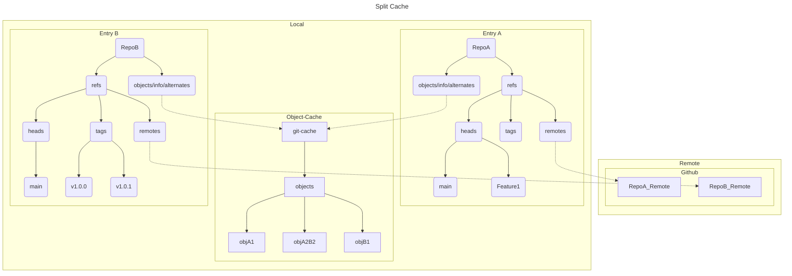

# Caching Git Repositories

## Motivation

Caching in `ace-dt git` prevents a fresh clone each time `ace-dt git to-oci` is used, which is the default behavior. Despite not caching by default, `ace-dt git` *always* attempts to reference a git cache when cloning a git repository; a safe operation.

## Caching

### git cache

Our caching feature is inspired by [git-cache](https://github.com/Seb35/git-cache), and functions very similarly.

Running `ace-dt git to-oci` with the `--cache-path CACHE_PATH` option creates a central cache for git repositories if it has not already been initialized. In the git cache, all objects are stored together. While the central cache holds the "main" repositories, subsequent clones use `git clone --shared --reference-if-able CACHE_PATH --bare GIT_REMOTE` to set up `.git/objects/info/alternates` which tells git to discover objects from the referenced repository. The git cache does not store remote references, only objects.

## Graph

The current approach allows us to cache references while keeping a shared object store. The main git cache holds all objects while fresh clones contain remote references.

