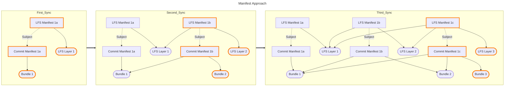
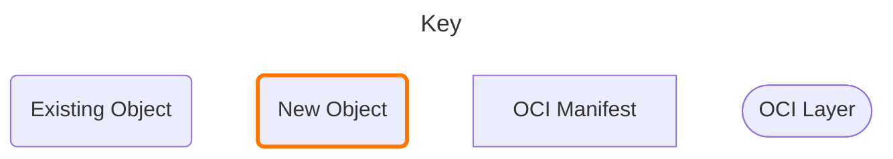
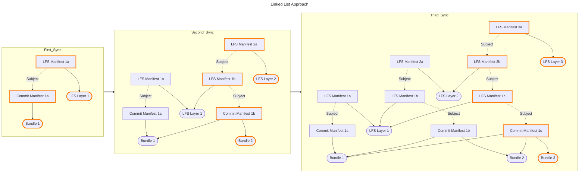

# Git LFS as OCI Data Model

## Background on LFS

LFS = Large File Storage

### Main Idea

Reduce local repository storage by only fetch large files on demand. Why store a large file if it's not needed?

### How?

Git LFS stores the large files in a Git LFS server while using "pointer files" in your local repository. The pointer files help Git LFS to discover and download the file contents when needed, e.g. when a branch is checked out.

## Goal

Add support for Git LFS in `ace-dt git`.

`ace-dt git` allows us to sync git repositories across an air gapped network by storing the git repo in an OCI format, mirroring the OCI manifest with `ace-dt mirror`, and rebuilding it on the high side.

This is an optional feature such that using `ace-dt git` may sync or rebuild repositories without using the Git LFS extension.

## Approaches

### Key

--Sync Manifest--: An OCI manifest with git bundle layers.

--Git Bundle--: A git bundle ".pack" file.

--LFS Manifest--: An OCI manifest with git LFS layers.

--LFS Layer--: An LFS object as a blob.

### Manifest Approach (Current)

#### Limitations

Theroretically, a respository may have a sufficient amount of LFS files to overflow the maximum manifest size of 4MB. This has yet to happen, but remains a concern. See LFS bundles [issue](https://gitlab.com/act3-ai/asce/data/tool/-/issues/503).

- Number of exiting OCI objects to update is constant (2):
  - 1 - Commit Manifest
  - 1 - LFS Manifest
- Number of new OCI objects is (1 + L), where L is the number of LFS Layers:
  - 1 - Bundle Layer
  - L - LFS Layers (archived, L = 1)

## Linked List

### Linked List Approach

- Number of OCI objects to create/update grows for each subsequent sync.
- Unbounded number of referrers

- Number of exiting OCI objects to update is (1 + E):
  - 1 - Commit Manifest
  - E - Existing LFS Manifests
- Number of new OCI objects is (2 + L), where L is the number of LFS Layers:
  - 1 Bundle Layer
  - 1 LFS Manifest
  - L LFS Layers (archived, L = 1)

### Index Approach

```mermaid
---
title: Index Approach
---
flowchart LR
    subgraph First_Sync
    LFSI_1_a[LFS Index 1a] -.-> |Subject| SyncM_1
    LFSI_1_a --> LFSM_1
    LFSM_1[LFS Manifest 1] --> LFSL_1([LFS Layer 1])

    SyncM_1[Commit Manifest 1a] --> Bundle_1([Bundle 1])
    end

    subgraph Second_Sync
    LFSI_2_a[LFS Index 1a] -.-> |Subject| SyncM_2_a
    LFSI_2_b[LFS Index 1b] -.-> |Subject| SyncM_2_b
    LFSI_2_a --> LFSM_2
    LFSI_2_b --> LFSM_2
    LFSI_2_b --> LFSM_2_2
    LFSM_2[LFS Manifest 1] --> LFSL_2([LFS Layer 1])
    LFSM_2_2[LFS Manifest 2] --> LFSL_2_2([LFS Layer 2])

    SyncM_2_a[Commit Manifest 1a] --> Bundle_2_1([Bundle 1])
    SyncM_2_b[Commit Manifest 1b] --> Bundle_2_1([Bundle 1])
    SyncM_2_b --> Bundle_2_2([Bundle 2])
    end

    subgraph Third_Sync
    LFSI_3_a[LFS Index 1a] -.-> |Subject| SyncM_3_a
    LFSI_3_b[LFS Index 1b] -.-> |Subject| SyncM_3_b
    LFSI_3_c[LFS Index 1c] -.-> |Subject| SyncM_3_c
    LFSI_3_a --> LFSM_3
    LFSI_3_b --> LFSM_3
    LFSI_3_b --> LFSM_3_2
    LFSI_3_c --> LFSM_3
    LFSI_3_c --> LFSM_3_2
    LFSI_3_c --> LFSM_3_3
    LFSM_3[LFS Manifest 1] --> LFSL_3([LFS Layer 1])
    LFSM_3_2[LFS Manifest 2] --> LFSL_3_2([LFS Layer 2])
    LFSM_3_3[LFS Manifest 3] --> LFSL_3_3([LFS Layer 3])

    SyncM_3_a[Commit Manifest 1a] --> Bundle_3_1([Bundle 1])
    SyncM_3_b[Commit Manifest 1b] --> Bundle_3_1
    SyncM_3_c[Commit Manifest 1c] --> Bundle_3_1
    SyncM_3_b --> Bundle_3_2([Bundle 2])
    SyncM_3_c --> Bundle_3_2
    SyncM_3_c --> Bundle_3_3([Bundle 3])
    end

    First_Sync ==> Second_Sync
    Second_Sync ==> Third_Sync

    classDef update stroke:#f70,stroke-width:3px
    class LFSI_1_a,SyncM_1,LFSL_1,Bundle_1,LFSM_1 update
    class LFSM_2_2,LFSL_2_2,LFSI_2_b,Bundle_2_2,SyncM_2_b update
    class LFSL_3_3,LFSM_3_3,LFSI_3_c,Bundle_3_3,SyncM_3_c update
```

- Number of exiting OCI objects to update is constant (2):
  - 1 - Commit Manifest
  - 1 - LFSIndex
- Number of new OCI objects is (2 + L), where L is the number of LFS Layers:
  - 1 - Bundle Layer
  - 1 - LFS Manifest
  - L - LFS Layers (archived, L = 1)
