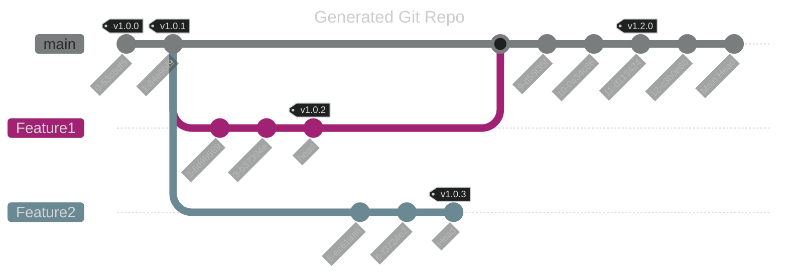
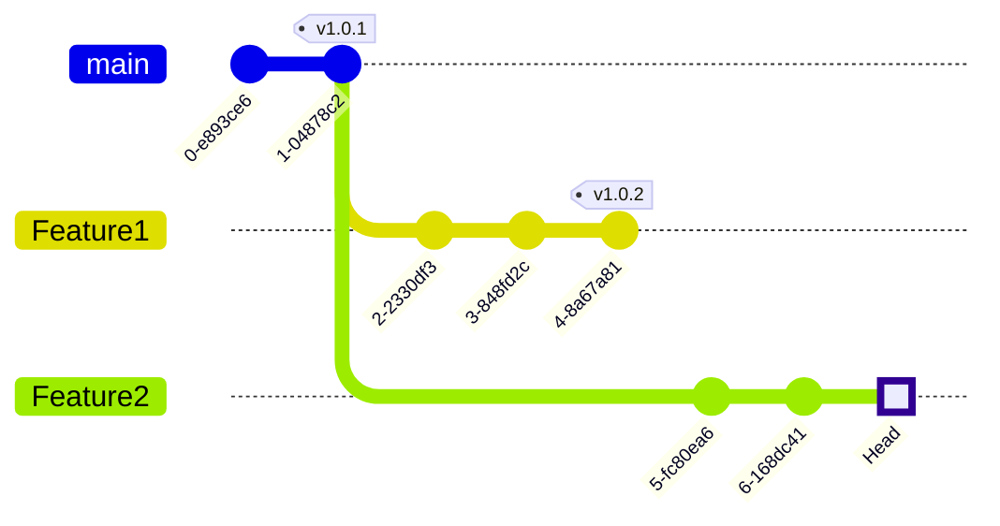
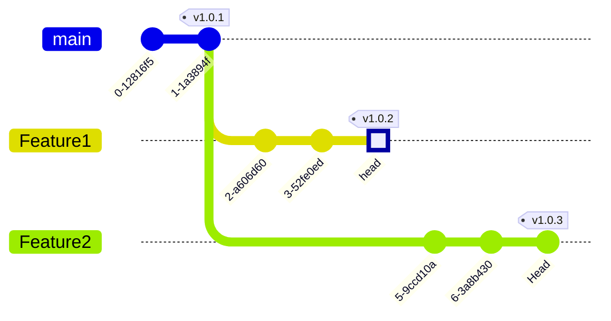
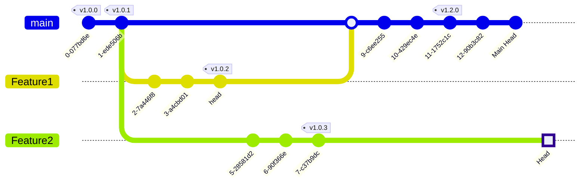

# Results of test repository creation functions

## Result of createGitRepo

## Base Test Cases

Note: The location of changes are highlighted (a square).

### Base Layer

### Add Tag Ref to New Commit

This test does not contain the branch head ref, only the tag on the branch.

### Add Head Ref to New Commit

This test does not contain the v1.0.3 tag, but does contain the head reference.

### Add Tag Ref to Existing Branch Head Ref

This tests adds the v1.0.3 tag to the existing head reference.

### Add Branch Head Ref to Existing Tag Ref

### Add Tag Ref to Existing Commit

### Add Tag Ref to New Commit - For Commit Tips Min Set

This test is mainly for testing commit tip updating.

## Result of updateGitRepo

## Test Cases - that require an update

### Update Branch Head Ref

### Update Tag Ref

## createLFSRepo

## Test Rewritten Git History

### Base Case

### Rewrite - Diverge History

Rewrite git history with `git reset --hard`, by one commit on two branches. The histories of `main-new` and `Feature1-new` are the new `main` and `Feature1` histories, mermaid does not have great tooling to represent rewritten history. Consider the old square commits as dangling.

### Rewrite - Reset History

Rewrite git history with `git reset --hard`, by one commit on the `Feature1` branch, ensuring no new bundle is created since we don't have any new commits.

