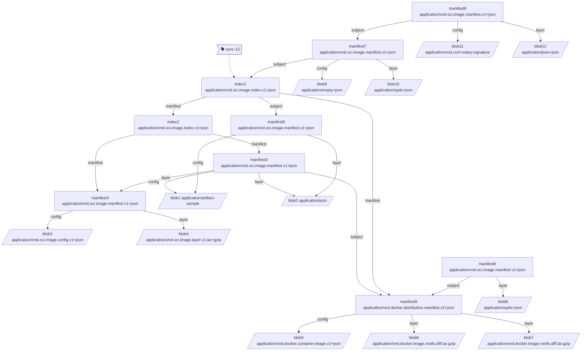

# Mirroring

## Test Set 1

Diagram

```mermaid
flowchart TD
    tag1>fa:fa-tag sync-13]

    index1(index1\napplication/vnd.oci.image.index.v1+json)
    index2(index2\napplication/vnd.oci.image.index.v1+json)

    manifest3[manifest3\napplication/vnd.oci.image.manifest.v1+json]
    manifest4[manifest4\napplication/vnd.oci.image.manifest.v1+json]
    manifest5[manifest5\napplication/vnd.docker.distribution.manifest.v2+json]
    manifest6[manifest6\napplication/vnd.oci.image.manifest.v1+json]
    manifest7[manifest7\napplication/vnd.oci.image.manifest.v1+json]
    manifest8[manifest8\napplication/vnd.oci.image.manifest.v1+json]
    manifest9[manifest9\napplication/vnd.oci.image.manifest.v1+json]

    blob1[/blob1 application/artifact-sample/]
    blob2[/blob2 application/json/]
    blob3[/blob3\napplication/vnd.oci.image.config.v1+json/]
    blob4[/blob4\napplication/vnd.oci.image.layer.v1.tar+gzip/]
    blob5[/blob5\napplication/vnd.docker.container.image.v1+json/]
    blob6[/blob6\napplication/vnd.docker.image.rootfs.diff.tar.gzip/]
    blob7[/blob7\napplication/vnd.docker.image.rootfs.diff.tar.gzip/]
    blob8[/blob8\napplication/spdx+json/]
    blob9[/blob9\napplication/empty+json/]
    blob10[/blob10\napplication/spdx+json/]
    blob11[/blob11\napplication/vnd.cncf.notary.signature/]
    blob12[/blob12\napplication/jose+json/]

    tag1 -.-> index1
    index1 --> |manifest| index2
    index2 --> |manifest| manifest3
    manifest3 --> |config| blob1
    manifest3 --> |layer| blob2
    manifest3 -----> |subject| manifest5
    index2 --> |manifest| manifest4
    manifest4 --> |config| blob3
    manifest4 --> |layer| blob4
    index1 --> |manifest| manifest5
    index1 --> |subject| manifest9
    manifest5 --> |config| blob5
    manifest5 --> |layer| blob6
    manifest5 --> |layer| blob7
    manifest6 --> |subject| manifest5
    manifest6 --> |layer| blob8
    manifest7 --> |subject| index1
    manifest7 --> |config| blob9
    manifest7 --> |layer| blob10
    manifest8 --> |subject| manifest7
    manifest8 --> |config| blob11
    manifest8 --> |layer| blob12
    manifest9 ---> |config| blob1
    manifest9 ---> |layer| blob2

    %% The manifest JSON (manifest4) is also included as a layer in manifest3
    manifest3 --> |layer|manifest4
```
